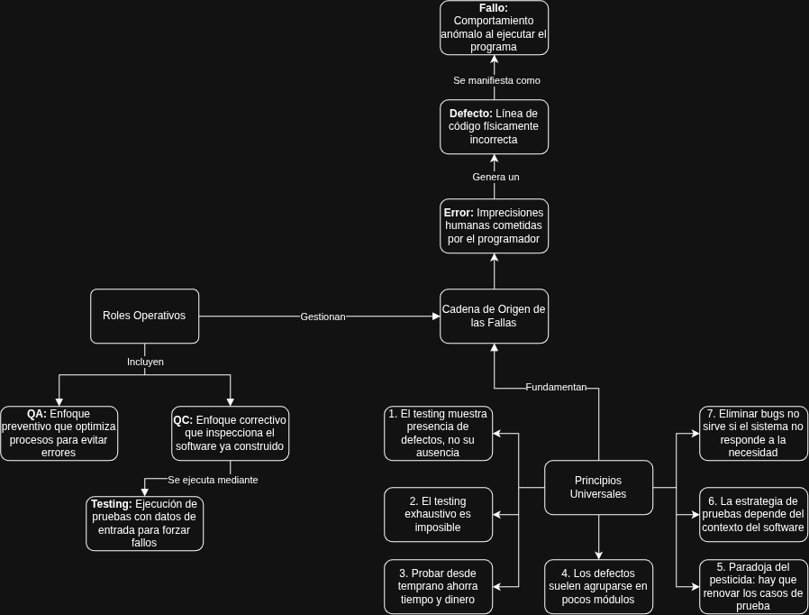

# Casos de Prueba

## Actividad 1 - Mapa Conceptual

## Plan de Pruebas

|ID  |Descripción|Precondicíon|Entrada|Esperado|Real|Estado|
|----|-----------|------------|-------|--------|----|------|
|CP-01|Verificar el comportamiento del sistema con un valor de presupuesto fuera del rango ||||||
|CP-02|Verificar que el sistema rechaze campos no numéricos cuándo se requier ingreso de un número||||||
|CP-03|Verificar el ocmportamiento del sistma cuándo se ubica un escenario sin socios||||||

