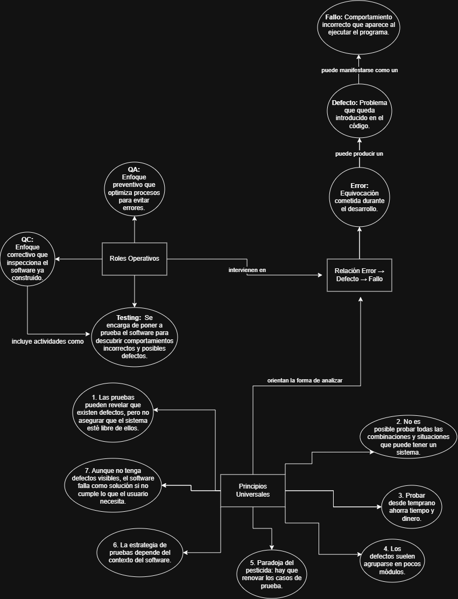

# Taller de Pruebas de Caja Negra

## Datos del trabajo

| Dato | Información |
|---|---|
| **Universidad** | Universidad Internacional del Ecuador |
| **Carrera** | Sistemas de la Información |
| **Materia** | Diseño de Pruebas, Control de Calidad y Mantenimiento |
| **Profesor** | Pablo Javier Robayo Castellanos |
| **Integrantes** | Sebastián Aucapiña y Bryan Montaguano |
| **Fecha de entrega** | 07/09/2026 |
| **Repositorio** | [taller_caja_negra](https://github.com/Auc4/taller_caja_negra) |

---

## Actividad 1 - Mapa conceptual

Realizamos un mapa conceptual sobre **QA, QC y Testing**, los **7 principios de ISTQB** y la relación **Error → Defecto → Fallo**.



También dejamos el archivo original del mapa por si se necesita revisar:

[Ver mapa conceptual en Google Drive](https://drive.google.com/file/d/10zU0H-B_1V8JXdKSbsW8ImlpdFSi0mMe/view?usp=sharing)

---

## Actividad 2 - Código base

Guardamos el archivo `presupuesto_analisis.py` y comprobamos que el programa inicia y permite ingresar los datos.

En esta etapa no corregimos el código. La idea era mantenerlo como fue entregado para después diseñar las pruebas y localizar los defectos.

---

## Actividad 3 - Diseño de los casos de prueba

Antes de ejecutar el programa planteamos tres casos de prueba usando **partición de equivalencia** y **valores límite**.

La tabla ya aparece completa porque las columnas **Real** y **Estado** se llenaron después, durante la Actividad 4.

| ID | Descripción | Precondición | Entrada | Esperado | Real | Estado |
|---|---|---|---|---|---|---|
| **CP-01** | Probar el programa con datos normales | Programa iniciado y listo para recibir datos | `presupuesto=1000`, `socios=2`, `meses=2` | El programa debería calcular `$40.00` de intereses, un total de `$1040.00` y una cuota de `$520.00` por socio. | El programa calculó `$80.00` de intereses, un total de `$1080.00` y una cuota de `$540.00` por socio. | **Failed** |
| **CP-02** | Probar el límite inválido de socios | Programa iniciado; presupuesto y meses válidos | `presupuesto=1000`, `socios=0`, `meses=2` | El programa debería detectar que no puede trabajar con `0` socios y mostrar un mensaje controlado. | El programa se cerró con `ZeroDivisionError: float division by zero`. | **Failed** |
| **CP-03** | Probar una cantidad negativa de meses | Programa iniciado; presupuesto y socios válidos | `presupuesto=1000`, `socios=2`, `meses=-1` | El programa debería rechazar el valor negativo y mostrar un mensaje indicando que los meses no son válidos. | El programa aceptó `-1` y realizó el cálculo: intereses `$20.00`, total `$1020.00` y cuota `$510.00`. | **Failed** |

### Técnicas usadas

- **CP-01:** partición de equivalencia, usando datos normales y válidos.
- **CP-02:** análisis de valores límite, usando `socios=0`, justo por debajo del mínimo válido de `1`.
- **CP-03:** partición de equivalencia con un valor inválido. En este caso asumimos que una inversión no debería tener una cantidad negativa de meses.

---

## Actividad 4 - Ejecución y localización de defectos

Después de ejecutar los tres casos, comparamos lo que esperábamos con lo que realmente hizo el programa. Los tres casos terminaron en **Failed**, pero por motivos diferentes.

### CP-01 - Cálculo incorrecto de intereses

**Fallo que vimos:**  
Con `presupuesto=1000`, `socios=2` y `meses=2`, esperábamos `$40.00` de intereses, pero el programa mostró `$80.00`.

**Defecto encontrado:**  
En la **línea 10** se encuentra este cálculo:

```python
intereses = presupuesto * tasa_interes_mensual * (meses ** 2)
```

El problema es que los meses se elevan al cuadrado. Para `meses=2`, el programa usa `4` en el cálculo, por eso el interés termina siendo mayor de lo esperado.

---

### CP-02 - División entre cero

**Fallo que vimos:**  
Al ingresar `socios=0`, el programa se detuvo con este error:

```text
ZeroDivisionError: float division by zero
```

**Defecto encontrado:**  
En la **línea 13** se realiza la división directamente:

```python
cuota_por_socio = total / socios
```

El programa no comprueba antes si `socios` es `0`, así que intenta dividir entre cero y se detiene.

---

### CP-03 - Se aceptan meses negativos

**Fallo que vimos:**  
Ingresamos `meses=-1` y el programa lo aceptó como si fuera un valor normal. Después mostró `$20.00` de intereses, `$1020.00` de total y `$510.00` de cuota por socio.

**Defecto encontrado:**  
El dato de los meses se recibe en la **línea 6**:

```python
meses = int(input("Ingrese los meses de inversión: "))
```

Después de recibirlo no existe una validación que compruebe que el valor sea mayor que cero. Además, más adelante el programa eleva los meses al cuadrado, por lo que `-1` termina convirtiéndose en un valor positivo dentro del cálculo.

---

## Resumen de la Actividad 4

| Caso | Fallo encontrado | Línea relacionada | Defecto |
|---|---|---:|---|
| **CP-01** | Los intereses son mayores a los esperados | **10** | Se usa `(meses ** 2)` en el cálculo |
| **CP-02** | El programa se cierra con `socios=0` | **13** | Se divide entre `socios` sin validar que sea distinto de cero |
| **CP-03** | El programa acepta meses negativos | **6** | Se recibe el valor de `meses` sin una validación posterior |

Con esto dejamos registrados los fallos que observamos y la parte del código relacionada con cada uno. El archivo original se mantiene sin corregir para conservar la evidencia del ejercicio.
